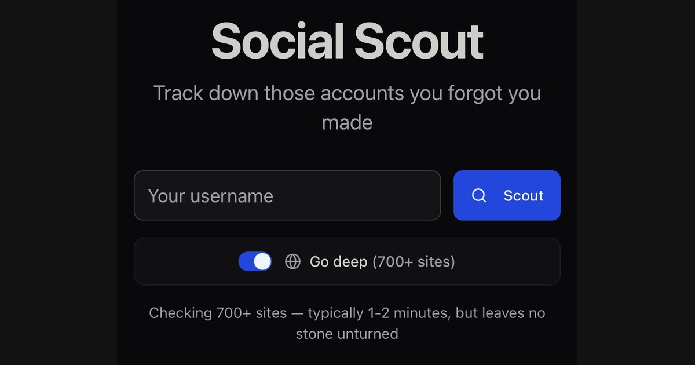

# Account Discovery

Find your forgotten accounts across 30+ social media platforms with accurate three-tier verification.




## Why This Tool

Most username discovery tools flood you with false positives. Sherlock, the most popular option, has a 30-40% false positive rate because it relies on simple HTTP status checks.

This tool achieves **<5% false positives** through intelligent three-tier verification that actually checks if accounts exist, not just if pages load.

## Features

- **Three-tier verification** - API calls (95% confidence), browser automation (85%), and smart HTTP analysis (70%)
- **30+ supported platforms** - GitHub, Reddit, Bluesky, Twitter, Instagram, TikTok, LinkedIn, YouTube, and more
- **Username variations** - Automatically tries platform-specific patterns (luke.steuber → lukesteuber, luke-steuber, etc.)
- **Real-time results** - Streams results as they arrive, checking high-volume platforms first
- **Account management** - Track discovered accounts, mark false positives, manage cleanup
- **Deep search mode** - Optional integration with WhatsMyName for 500+ additional platforms
- **Fast parallel search** - 200 concurrent requests with smart rate limiting

## How It Works

**Tier 1 - Official APIs (95%+ confidence)**
GitHub, Reddit, Bluesky, Medium, TikTok - uses official platform APIs for definitive results.

**Tier 2 - Browser Automation (85% confidence)**
Instagram, Facebook, LinkedIn, YouTube - uses Playwright to check actual page content.

**Tier 3 - Smart HTTP (70-90% confidence)**
Steam, GitLab, Patreon, SoundCloud, Dribbble - combines HTTP checks with content analysis.

## Installation

```bash
# Clone the repository
git clone https://github.com/lukeslp/account-discovery.git
cd account-discovery

# Create virtual environment
python -m venv venv
source venv/bin/activate  # On Windows: venv\Scripts\activate

# Install dependencies
pip install -r requirements.txt

# Install browser for Tier 2 verification
playwright install chromium

# Run the server
python run.py
```

The API will be available at `http://localhost:8000`

## Usage

**Start a search:**
```bash
curl -X POST http://localhost:8000/api/searches \
  -H "Content-Type: application/json" \
  -d '{"username": "lukesteuber", "tiers": [1, 2, 3]}'
```

**Check progress:**
```bash
curl http://localhost:8000/api/searches/1
```

**Get results:**
```bash
curl http://localhost:8000/api/searches/1/results
```

**See supported platforms:**
```bash
curl http://localhost:8000/api/platforms
```

## API Endpoints

| Endpoint | Method | Description |
|----------|--------|-------------|
| `/api/health` | GET | Health check |
| `/api/stats` | GET | Statistics (total searches, accounts, platforms) |
| `/api/searches` | POST | Create new search |
| `/api/searches` | GET | List all searches |
| `/api/searches/{id}` | GET | Get search progress and details |
| `/api/searches/{id}/results` | GET | Get found accounts |
| `/api/platforms` | GET | List supported platforms |
| `/api/accounts` | GET | List all discovered accounts |
| `/api/accounts/{id}` | PATCH | Update account status |
| `/api/accounts/bulk-update` | POST | Bulk update accounts |

## Configuration

Create a `.env` file:
```
DEBUG=false
PORT=8000
DATABASE_URL=sqlite+aiosqlite:///./data/accounts.db
```

Key settings (in `backend/config/settings.py`):
- `max_concurrent_requests`: 200 - high concurrency for speed
- `request_timeout`: 5 - aggressive timeout since most platforms respond in 1-2 seconds
- Confidence thresholds: API (95%), Browser (85%), HTTP (70%)

## Architecture

```
backend/
├── api/              # FastAPI REST API with async background tasks
├── config/           # Settings and platform definitions (platforms.yaml)
├── core/             # Search orchestration, username variations, WhatsMyName
├── db/               # SQLAlchemy models (Search, Account, PlatformCheck)
└── platforms/
    ├── base.py       # BaseVerifier pattern
    └── verifiers/    # APIVerifier, BrowserVerifier, HTTPVerifier, WMNVerifier
```

**Core patterns:**
- Async generators stream results in real-time
- Platform prioritization checks popular sites first
- Semaphore-based concurrency prevents rate limiting
- Username variations increase discovery rate
- Background tasks for non-blocking searches

## Adding New Platforms

Edit `backend/config/platforms.yaml`:
```yaml
newplatform:
  name: New Platform
  category: social
  tier: 1
  enabled: true
  url_template: "https://example.com/{username}"
  api_endpoint: "https://api.example.com/users/{username}"
  verification_method: api
```

For complex platforms, add a custom handler in the appropriate verifier (`api.py`, `browser.py`, or `http.py`).

## Tech Stack

- **Backend**: FastAPI, SQLAlchemy, Playwright, httpx
- **Database**: SQLite with async support (aiosqlite)
- **Frontend**: React, Vite, Tailwind CSS, shadcn/ui
- **Deployment**: Production at [dr.eamer.dev/social-scout](https://dr.eamer.dev/social-scout/)

## License

MIT License - see LICENSE file for details

## Author

**Luke Steuber**
Website: [dr.eamer.dev](https://dr.eamer.dev)
Bluesky: [@lukesteuber.com](https://bsky.app/profile/lukesteuber.com)
Email: luke@lukesteuber.com
